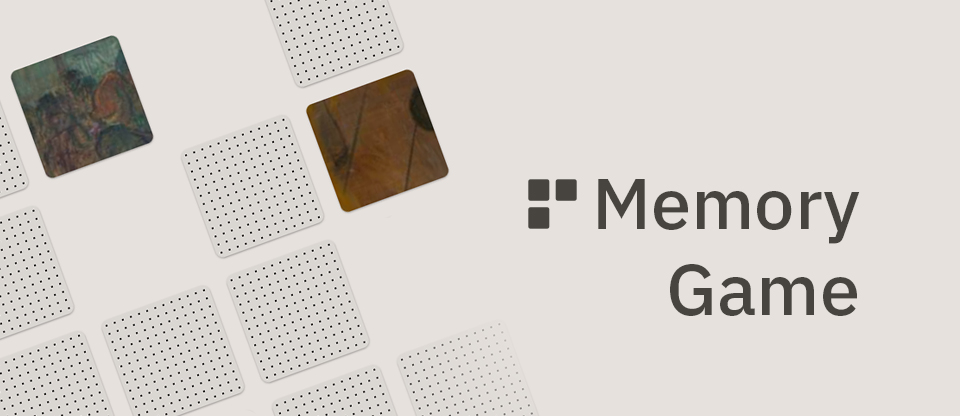
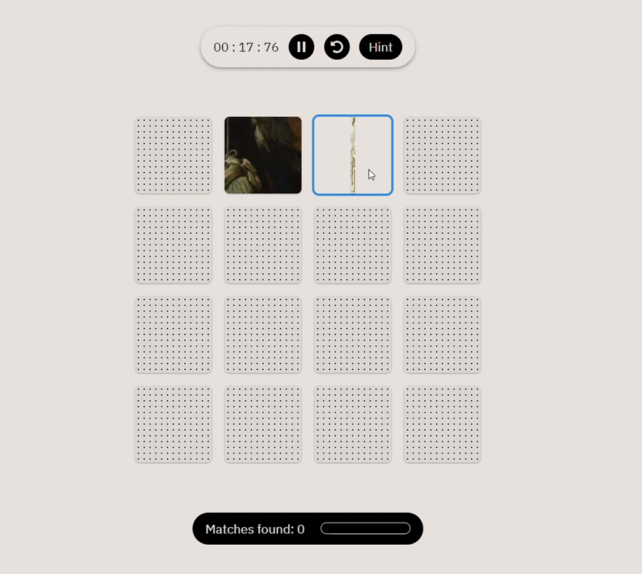

<div align="center">
  
  <p align="center" >
  <a href="#" >View Demo (Coming Soon)</a>
  </p>
</div>

# Memory Game

[](https://opensource.org/licenses/MIT)

A memory game that uses public domain artwork from the Art Institute of Chicago's API. Each deck of cards includes matching pairs that feature close-ups of famous works of art.




## Built With
- [React](https://react.dev/)
- [Vite](https://vitejs.dev/)
- [TypeScript](https://www.typescriptlang.org/)
- [Tailwind CSS](https://tailwindcss.com/)
- [Material UI](https://mui.com/material-ui/)

## Features
- Playable with a mouse or keyboard
- Three difficulty levels: Easy, Medium, Hard
- API data is cached in local storage

## API
This project uses public domain artwork queried from [the Art Institute of Chicago's public API](https://www.artic.edu/open-access/public-api). All images are courtesy of AIC's [Open Access initiative](https://www.artic.edu/open-access/open-access-images). Big thanks to the Art Institute of Chicago for use of their data!

## Run It Locally
To start up a local development server, you'll need [Git](https://git-scm.com/) and [Node.js](https://nodejs.org/en) (which comes with NPM) installed on your computer. Then run the following commands in the terminal:

1. Clone the repository:
```
git clone https://github.com/bridget-kessler/memory-game.git
```

2. Move into the newly created memory-game directory:
```
cd memory-game
```

3. Install the required dependencies:
```
npm install
```
4. Start the development server, which will use the default port 5173 if not in use, and open localhost:5173 in your web browser:
```
npm run dev
```

## License
[MIT License](https://github.com/bridget-kessler/memory-game?tab=MIT-1-ov-file#readme)